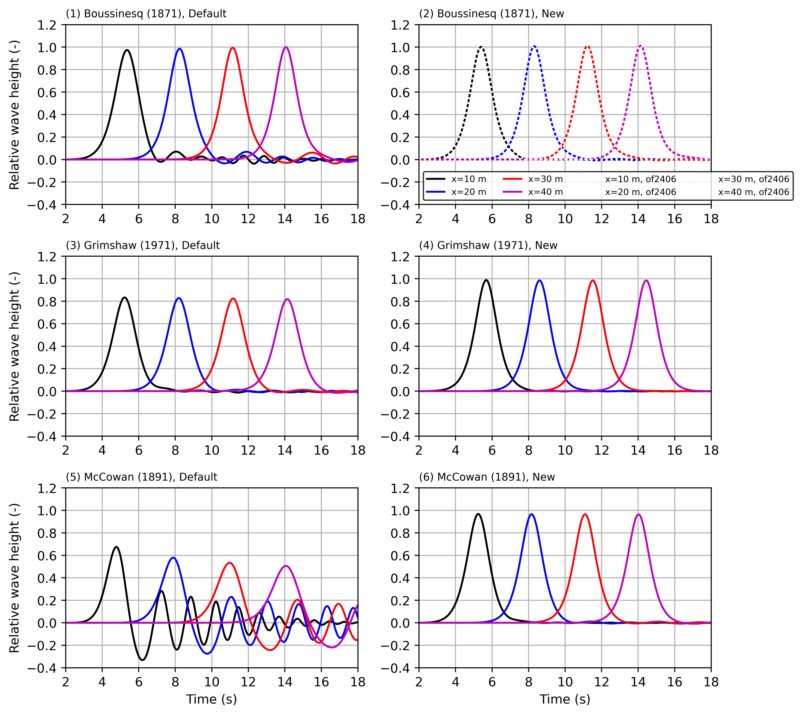

In openFoam, the source codes of the solitary wave are modified.

 
<em>**Figure 1** Solitary waves generated by the default soure codes (left: 1, 3, 5) and the modified source codes (right: 2, 4, 6)</em>

