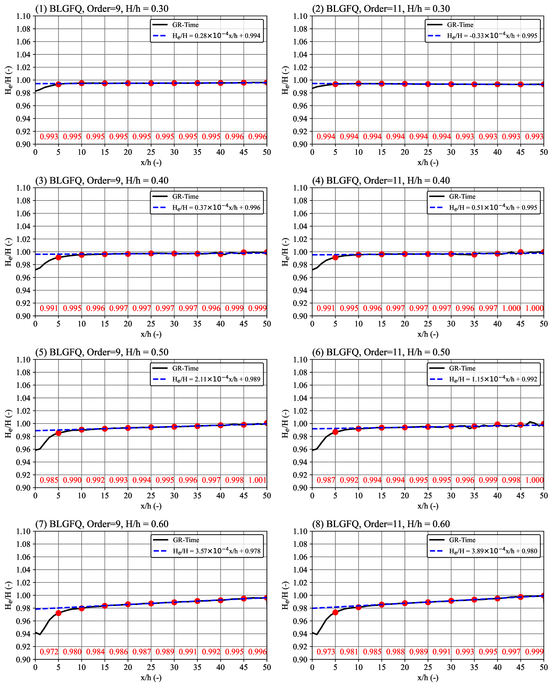

# Solitary waves from a Dirichlet and Neumann boundary in OpenFOAM

## Introduction

`OpenFOAM` is widely used to conduct numerical simulations in hydrodynamics. However, the wave-making capability of OpenFOAM needs to be enhanced.

This repo introduces new methodologies to make large amplitude solitary waves. New methodologies are integrated with the weakly-nonliear solutions, the implicit analytical solution.

## Demo

以下是一个引用本地图片的示例：



**图片说明：** 这是项目的架构示意图，展示了各个组件之间的关系。

## 图片引用规范

### 本地图片引用
语法：``
- **替代文本**：当图片无法显示时展示的文字描述
- **路径**：图片文件相对于当前 Markdown 文件的位置

### 示例代码

```markdown
<!-- 引用同级目录图片 -->


<!-- 引用子目录图片 -->


<!-- 引用上级目录图片 -->


<!-- 使用网络图片 -->
