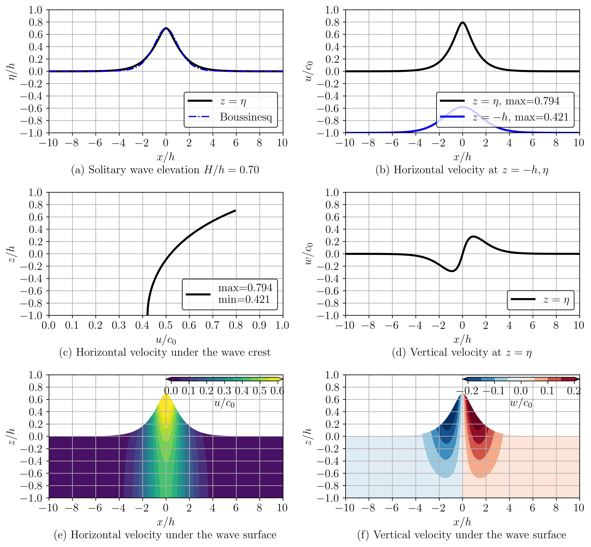
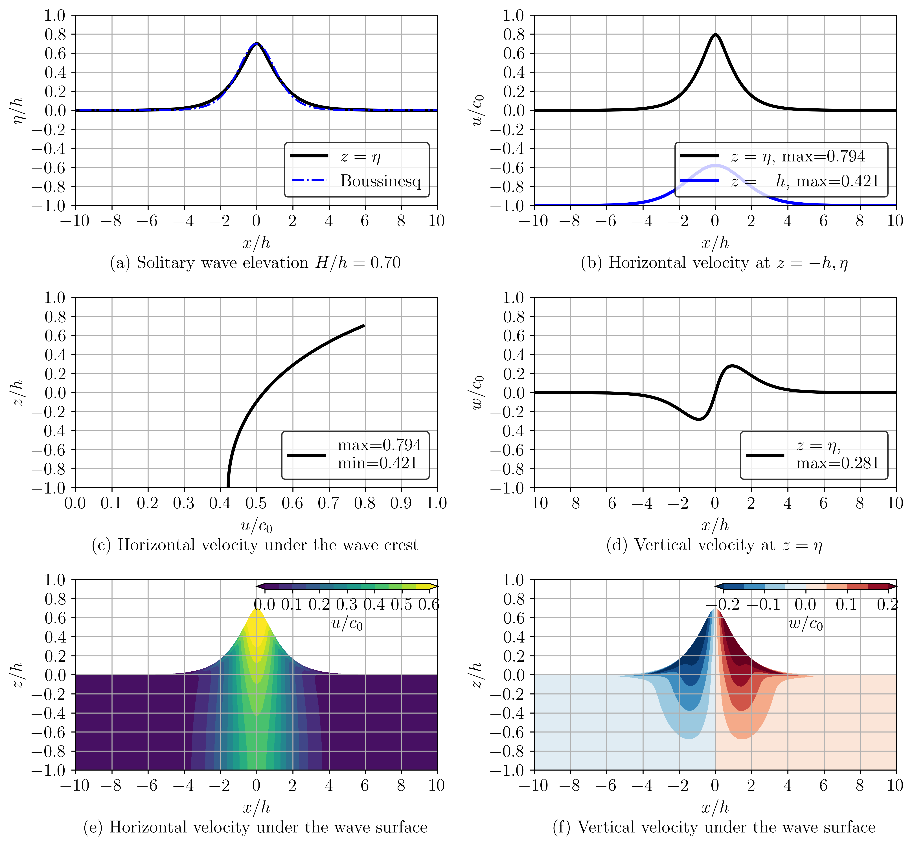

# High-fidelity solitary wave

## 1. solitary waves of Tanaka (1996) and Clamond & Dutyth (2013)

  <figure>
    
    <figcaption align="center">
      <b>Figure 1:</b> Solitary wave H/h=0.7 calculated with Clamond & Dutyth (2013)
    </figcaption>
  </figure>

  <figure>
    
    <figcaption align="center">
      <b>Figure 2:</b> Solitary wave H/h=0.7 calculated with Tanaka (1996)
    </figcaption>
  </figure>

The significant discrepancy emerges in the vertical velocity (Figure 2 (f)), x=2~4 near the surface.
